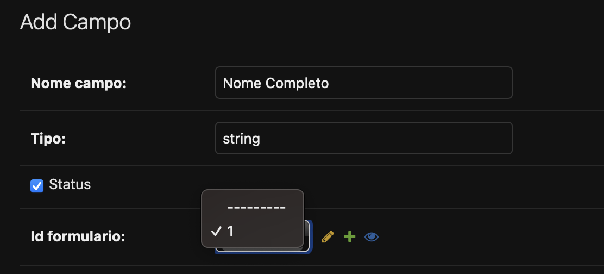

# Desafio Técnico Django

Repositório dedicado ao Desafio Técnico para seleção de desenvolvedor Python.


Tecnologias Utiliadas:

- Django
- Django Rest Framework
- Postgres
- React
- Docker


## Instalção

Primeiramente será necessário entrar no diretório "backend":

```bash
cd backend/
```

Realizar o build da imagem utiliando docker-compose:

```bash
docker-compose build
```

Por fim subir o container da API:

```bash
docker-compose up
```

Os processos do RabbitMQ e do django-celery irão subir automaticamente, assim como as migrações do banco de dados e o admin-user como root (usuário: root , senha: root).

Agora para iniciar o frontend, abrir um novo terminal e realiar o mesmo processo porém na pasta "frontend":

```bash
cd frontend/
docker-compose build
docker-compose up
```

A API está servida na url: http://localhost:8000/

Já o Frontend servido na url: http://localhost:3000/


# Configuração

Após o ambiente da API subir corretamente, entrar na área de administrador pela rota http://localhost:8000/admin e entrar com a conta e senha root.

Será mostrado então as seguintes entidades:


Primeiro configurar a tabela Formulário:


** Obs: Importante garantir que o id do formulário seja '1' conforme mostrado abaixo:


Após isso, entrar agora em Campos para o administrador poder configurar todos os campos desejados a ser mostrado no frontend:




Exemplos de campos cadastrados:


Após cadastrados é possível entrar no frontend com os campos cadastrados e pronto para serem salvos.


Após submeter o formulário, será possível observar que os dados serão salvos na tabela 'Registros':


E por fim o django-celery irá ficar encarregado de avaliar cada registro submetido e aplicar o status 'Aprovado' ou 'Negado' na tabela 'Propostas' conforme mostrado abaixo:


